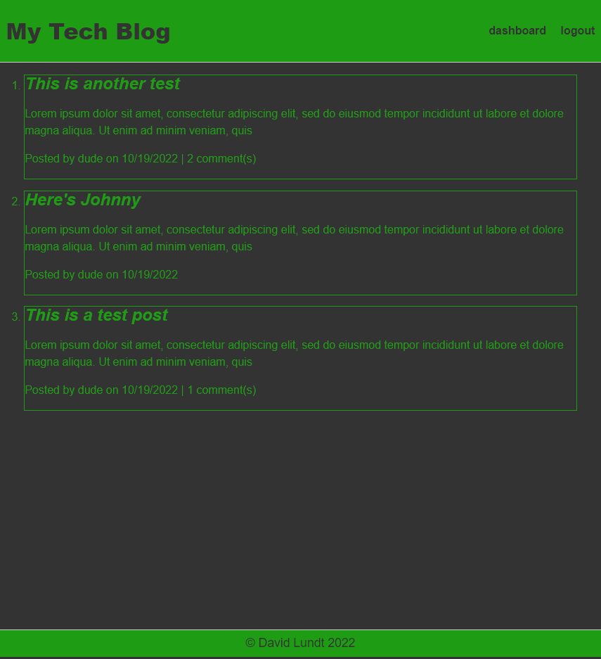

# [Tech Blog Site](https://github.com/apatheticjedi/tech-blog-site)

### Table of Contents

1. [Description](#description)
2. [Built With](#built-with)
3. [Installation](#installation)
4. [Usage](#usage)
5. [Contributing](#contributing)
6. [Acknowledgments](#acknowledgments)
7. [Questions](#questions)

## Description

This is an example of a CMS-style blog site that uses the MVC architectural structure. The site uses Handlebars.js as the templating language, Sequelize as the ORM, and express-session for package authentication. See the deployed site here: 

[Heroku Deployment](https://pure-meadow-28605.herokuapp.com/)

### Built With

* JavaScript
* HTML
* CSS
* Node.js 

## Installation

Clone the repo, then type 
~~~ 
npm install 
~~~ 
to install all package dependancies. Type 
~~~ 
npm start 
~~~ 
to start the server on your localhost.

(<a href="#top">back to top</a>)

## Usage

Create a username and password on the login page, then the user can view all posts on the main page, or post, edit, and delete their own posts on the dashboard page. Comments can be left on each individual post by clicking on the post title to view the individual post page.

## Contributing

Please contact me for information on contributing to this project

(<a href="#top">back to top</a>)

## Acknowledgments

* express npm
* sequelize npm
* dotenv npm
* express-handlebars npm
* express-session npm
* mysql2 npm
* connect-session-sequelize npm
* bcryptjs npm

## Questions

Reach out to me with questions at:

[GitHub](https://github.com/apatheticjedi)

## License

[MIT License](https://spdx.org/licenses/MIT.html)

(<a href="#top">back to top</a>)

